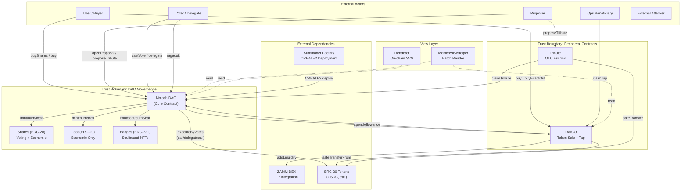

# Threat Model Report: Moloch (Majeur) DAO Framework

## Architectural Diagram

---

## Roles

### Administrative Roles

| Role | Privileges | Risk Level |
|------|------------|------------|
| **DAO (self-call)** | Full control: mint/burn shares & loot, set governance params, execute arbitrary calls/delegatecalls, set permits, set allowances, manage sales, lock/unlock transfers, batch external calls | **Critical** |
| **Summoner (Factory)** | Deploys new DAO instances via CREATE2, calls `init()` once per DAO | **High** |
| **Ops Beneficiary** | Receives tap funds from DAICO; can be changed by DAO | **Medium** |

### User Roles

| Role | Actions | Risk Exposure |
|------|---------|---------------|
| **Share Holder** | Vote, delegate, ragequit, transfer shares, chat (if badge holder), propose | Economic + governance rights at risk if shares are diluted or stolen |
| **Loot Holder** | Ragequit, transfer loot | Economic rights only; no voting power |
| **Badge Holder** | Chat access, visual NFT identity (auto-assigned to top-256 shareholders) | Identity/access; soulbound so non-transferable |
| **Proposer** | Open proposals, propose tributes, cancel own proposals/tributes | Locked tribute funds at risk |
| **Buyer** | Purchase shares/loot via Moloch `buyShares` or DAICO `buy`/`buyExactOut` | Funds at risk during purchase (slippage, price manipulation) |
| **Delegate** | Receives delegated voting power (single or split) | Can influence votes; reputation risk |
| **Futarchy Participant** | Fund futarchy pools, receive receipt tokens, cash out winnings | Funds locked in prediction market |

### External Systems

| System | Integration Point | Risk Level |
|--------|------------------|------------|
| **ZAMM DEX** | `DAICO._initLP()` calls `ZAMM.addLiquidity()` — hardcoded singleton at `0x000...0eD` | **High** — LP funds at risk if ZAMM is compromised or manipulated |
| **Arbitrary ERC-20 Tokens** | Used as payment tokens, tribute tokens, sale tokens throughout | **High** — fee-on-transfer, rebasing, or malicious tokens can break invariants |
| **Arbitrary External Contracts** | `executeByVotes` and `batchCalls` can call/delegatecall any address | **Critical** — the DAO can interact with any contract |

---

## Assets

| Asset | Description | Trust Levels Required |
|-------|-------------|-----------------------|
| **DAO Treasury (ETH + ERC-20s)** | All ETH and tokens held by the Moloch contract; distributable via ragequit | DAO governance (proposal + vote), ragequit by members, spendAllowance by approved spenders |
| **Share Tokens** | Voting power + economic rights; can be minted by DAO | DAO governance for minting; holders for transfer |
| **Loot Tokens** | Economic-only rights; can be minted by DAO | DAO governance for minting; holders for transfer |
| **Futarchy Pools** | Prediction market reward pools funded by ETH, shares, or loot | Funders deposit; winners claim after resolution |
| **Permit Allowances** | Pre-authorized execution rights (ERC-6909 tokens granting call permissions) | DAO sets permits; permit holders spend them |
| **Treasury Allowances** | `allowance[token][spender]` — pre-approved spending from DAO treasury | DAO sets; spender drains |
| **Tribute Escrow Funds** | ETH/ERC-20s locked in Tribute contract awaiting DAO claim | Proposer to cancel; DAO to claim |
| **DAICO Sale Proceeds** | Funds flowing through DAICO from token sales + tap | Buyers pay; DAO receives; ops claims tap |
| **Governance Parameters** | Quorum, TTL, timelock, thresholds, ragequit flag, transfer locks | DAO governance only |
| **On-chain Chat Messages** | Permanent on-chain message history gated by badge ownership | Badge holders (top-256 shareholders) |
| **LP Positions** | Liquidity positions created via ZAMM during DAICO sales | DAO receives LP tokens |

---

## Security Threats

### 1. Moloch Core — Proposal & Execution

| STRIDE | Threat | Description | Affected Surface | Priority |
|--------|--------|-------------|------------------|----------|
| Spoofing | **Proposal ID collision** | `_intentHashId` uses `keccak256(address(this), op, to, value, keccak256(data), nonce, config)`. A collision or pre-image manipulation could spoof a legitimate proposal, especially since proposal IDs are opened lazily | `openProposal`, `castVote`, `executeByVotes` | **MEDIUM** |
| Spoofing | **Snapshot manipulation via flash-loan delegation** | Snapshot is taken at `block.number - 1`. An attacker who can accumulate voting power at the snapshot block (via flash loans + delegation in a prior block) can influence votes | `castVote`, `shares.getPastVotes` | **HIGH** |
| Tampering | **Delegatecall execution overwrites storage** | `_execute` with `op=1` performs `delegatecall` into arbitrary target. Malicious calldata could overwrite Moloch storage slots if the target has compatible storage layout | `executeByVotes`, `spendPermit` | **CRITICAL** |
| Tampering | **Multicall delegatecall context abuse** | `multicall()` uses `delegatecall` to self, preserving `msg.sender` context. Combined with payable functions, this could allow re-use of `msg.value` across multiple sub-calls | `multicall` | **HIGH** |
| Tampering | **Governance parameter manipulation** | DAO can set `quorumBps=0`, `quorumAbsolute=0`, `minYesVotesAbsolute=0`, `proposalTTL=0`, `timelockDelay=0` simultaneously — allowing single-vote instant execution with no safety rails | `setQuorumBps`, `setQuorumAbsolute`, etc. | **HIGH** |
| Repudiation | **No vote receipts for abstain in futarchy** | Abstain voters receive receipt tokens but are excluded from futarchy payouts regardless of outcome; no explicit acknowledgment of this asymmetry | `castVote`, `cashOutFutarchy` | **LOW** |
| Information Disclosure | **Proposal contents visible before opening** | Anyone can compute `proposalId()` for a given action and observe it being discussed/voted on, leaking governance intent before execution | `proposalId` (public view) | **LOW** |
| Denial of Service | **Unbounded proposalIds array growth** | Every opened proposal pushes to `proposalIds[]` with no pruning. Over time this array grows indefinitely, increasing gas for view operations | `openProposal` | **LOW** |
| Denial of Service | **Blocking execution via timelock race** | If timelock is set, `executeByVotes` first queues (returning early) then on second call checks delay. A griefing attack could repeatedly queue proposals that never get executed within a reasonable window | `executeByVotes`, `queue` | **LOW** |
| Elevation of Privilege | **batchCalls arbitrary execution** | `batchCalls` executes arbitrary `call`s to any target with any value. Although gated by `onlyDAO`, a successful governance attack enables unrestricted fund extraction | `batchCalls` | **HIGH** |
| Elevation of Privilege | **Permit system bypasses governance vote** | `spendPermit` allows pre-authorized execution without a vote. If the DAO over-provisions permits (high count), the permit holder has persistent execution capability | `setPermit`, `spendPermit` | **HIGH** |

### 2. Moloch Core — Token Sale & Ragequit

| STRIDE | Threat | Description | Affected Surface | Priority |
|--------|--------|-------------|------------------|----------|
| Tampering | **Share price manipulation via `buyShares`** | `cost = shareAmount * price` can overflow silently in unchecked blocks (though Solidity 0.8.30 checks by default). If DAO sets `pricePerShare` to a very low value, shares are minted cheaply | `buyShares` | **MEDIUM** |
| Tampering | **Ragequit front-running** | An attacker can observe a ragequit transaction in the mempool and front-run it by depositing a worthless token, inflating the perceived treasury, or by ragequitting first to take a disproportionate share | `ragequit` | **HIGH** |
| Tampering | **Ragequit token ordering bypass** | The `tokens` array must be strictly ascending (`tk <= prev` check), but address ordering is arbitrary and tokens at low addresses could be systematically excluded | `ragequit` | **LOW** |
| Denial of Service | **Ragequit disabled permanently** | DAO governance can set `ragequittable = false`, trapping all members with no exit path. A 51% attack could lock the minority's funds | `setRagequittable` | **HIGH** |
| Denial of Service | **Transfer lock griefing** | DAO can lock share/loot transfers, preventing secondary market exits. Combined with ragequit disabled, members are completely trapped | `setTransfersLocked` | **MEDIUM** |
| Elevation of Privilege | **Sale minting dilution attack** | If `minting=true`, `buyShares` mints new shares. A well-funded attacker can buy massive shares to take over governance majority, then extract the treasury | `buyShares`, `setSale` | **HIGH** |

### 3. Moloch Core — Futarchy

| STRIDE | Threat | Description | Affected Surface | Priority |
|--------|--------|-------------|------------------|----------|
| Tampering | **Futarchy pool dilution** | Anyone can `fundFutarchy` with external tokens (if `rewardToken == address(0)` / ETH). An attacker could fund a pool then manipulate the vote outcome to claim the entire pool | `fundFutarchy` | **MEDIUM** |
| Tampering | **Auto-futarchy earmark manipulation** | `autoFutarchyParam` and `autoFutarchyCap` are set by governance. Incorrect configuration could over-earmark from DAO-held shares/loot, creating outsized futarchy rewards | `openProposal`, `setAutoFutarchy` | **MEDIUM** |
| Denial of Service | **Unresolvable futarchy** | If `winSupply == 0` when `_finalizeFutarchy` is called (no voters on winning side), `payoutPerUnit` is 0 and the pool is locked forever with no claim mechanism | `_finalizeFutarchy`, `cashOutFutarchy` | **MEDIUM** |
| Elevation of Privilege | **Receipt token trading for futarchy extraction** | Vote receipt tokens (ERC-6909) are transferable (unless `isPermitReceipt`). An attacker could buy winning-side receipts from voters, then claim the entire futarchy pool | `transfer` (ERC-6909), `cashOutFutarchy` | **HIGH** |

### 4. Moloch Core — Allowance & Permit System

| STRIDE | Threat | Description | Affected Surface | Priority |
|--------|--------|-------------|------------------|----------|
| Tampering | **Allowance draining** | `spendAllowance` pulls from the DAO treasury. If an allowance is set too high, the spender can drain the entire treasury allocation in one call | `spendAllowance`, `setAllowance` | **HIGH** |
| Spoofing | **Permit receipt ID as proposal ID collision** | Both proposals and permits use `_intentHashId`. Setting `executed[tokenId] = true` in `spendPermit` would block a proposal with the same ID from executing | `spendPermit`, `executeByVotes` | **MEDIUM** |
| Elevation of Privilege | **Permit tokens are ERC-6909 and transferable by default** | Although `isPermitReceipt` blocks transfer of permit tokens (`revert SBT()`), this check only applies if the flag is set. If a permit token ID doesn't have `isPermitReceipt` set, it could be transferred | `transfer`, `transferFrom` (ERC-6909) | **LOW** |

### 5. Shares Contract — Delegation & Voting

| STRIDE | Threat | Description | Affected Surface | Priority |
|--------|--------|-------------|------------------|----------|
| Spoofing | **Split delegation vote manipulation** | Split delegation distributes voting power to up to 4 delegates. Rounding in `_targetAlloc` (remainder-to-last) could be exploited with specific balance amounts to direct more votes than intended | `setSplitDelegation`, `_targetAlloc` | **MEDIUM** |
| Tampering | **Checkpoint overwrite in same block** | `_writeCheckpoint` updates in-place if `last.fromBlock == blk`. Multiple operations in the same block (e.g., via multicall or flashbots bundle) could manipulate checkpoint values | `_writeCheckpoint` | **MEDIUM** |
| Denial of Service | **Unbounded checkpoint array growth** | Each unique block with a balance change appends a new checkpoint. An attacker making tiny transfers every block could grow the array, increasing binary search cost for `getPastVotes` | `_writeCheckpoint`, `_checkpointsLookup` | **LOW** |
| Elevation of Privilege | **Governance takeover via share transfer + delegation** | If shares are transferable, an attacker can accumulate a majority, delegate to self, and pass any proposal. Combined with no timelock, this is an instant hostile takeover | `transfer`, `delegate`, `executeByVotes` | **HIGH** |

### 6. DAICO — Token Sale

| STRIDE | Threat | Description | Affected Surface | Priority |
|--------|--------|-------------|------------------|----------|
| Spoofing | **Fake DAO address in buy()** | `buy()` and `buyExactOut()` accept any `dao` address. If an attacker creates a contract that mimics a DAO, buyers could be tricked into purchasing worthless tokens | `buy`, `buyExactOut` | **MEDIUM** |
| Tampering | **LP price manipulation** | `_initLP` reads ZAMM pool reserves for drift protection. A flash loan attack could temporarily distort reserves, bypassing the drift cap and causing unfavorable LP ratios | `_initLP`, `buy`, `buyExactOut` | **HIGH** |
| Tampering | **Sale parameter manipulation by DAO** | `setSale` is callable by `msg.sender` (the DAO). A compromised DAO could set adversarial sale terms (near-zero price) mid-sale, allowing an attacker to drain tokens | `setSale` | **MEDIUM** |
| Information Disclosure | **Sale terms publicly readable** | All sale terms, tap rates, and LP configs are publicly visible on-chain, allowing front-running of favorable terms | `sales`, `taps`, `lpConfigs` mappings | **LOW** |
| Denial of Service | **ZAMM revert blocks all LP-enabled buys** | If ZAMM reverts (bug, pause, or migration), all `buy()`/`buyExactOut()` calls with LP enabled will fail, blocking the entire sale | `_initLP`, `ZAMM.addLiquidity` | **MEDIUM** |
| Elevation of Privilege | **Tap rate manipulation** | `setTapRate` is non-retroactive (forfeits unclaimed time). A governance attack could raise tap rate to drain the DAO treasury rapidly via the ops beneficiary | `setTapRate`, `claimTap` | **HIGH** |
| Elevation of Privilege | **Tap claim timestamp manipulation** | `claimTap` sets `lastClaim = block.timestamp` regardless of how much was actually claimed (capped by allowance/balance). Unclaimed amounts above the cap are permanently lost | `claimTap` | **MEDIUM** |

### 7. Tribute — OTC Escrow

| STRIDE | Threat | Description | Affected Surface | Priority |
|--------|--------|-------------|------------------|----------|
| Spoofing | **DAO impersonation in claimTribute** | `claimTribute` uses `msg.sender` as the DAO. Any contract can claim a tribute directed at it, not just Moloch DAOs. If a tribute is misdirected to a malicious address, the proposer loses funds | `claimTribute` | **MEDIUM** |
| Tampering | **Tribute ref array pollution** | `daoTributeRefs` and `proposerTributeRefs` grow indefinitely with no cleanup. Cancelled tributes leave stale entries, inflating gas costs for `getActiveDaoTributes` | `proposeTribute`, `getActiveDaoTributes` | **LOW** |
| Denial of Service | **Tribute griefing via dust deposits** | An attacker can spam `proposeTribute` with dust amounts to flood a DAO's tribute refs, making `getActiveDaoTributes` expensive and the UI slow | `proposeTribute` | **LOW** |
| Denial of Service | **Stuck ETH tribute** | If a proposer locks ETH as tribute and the DAO never claims it, the proposer can cancel. But if the proposer's address cannot receive ETH (contract without receive), cancellation fails and ETH is stuck | `cancelTribute`, `safeTransferETH` | **LOW** |

### 8. Cross-Cutting Concerns

| STRIDE | Threat | Description | Affected Surface | Priority |
|--------|--------|-------------|------------------|----------|
| Spoofing | **Fee-on-transfer token accounting** | All `safeTransferFrom` calls assume the received amount equals the parameter. Fee-on-transfer or rebasing tokens will cause accounting mismatches across ragequit, DAICO sales, tribute, and allowances | All transfer logic | **HIGH** |
| Tampering | **Reentrancy via ERC-777 or callback tokens** | While `nonReentrant` guards exist on key functions, cross-contract reentrancy between Moloch, DAICO, and Tribute may be possible if a callback token (ERC-777) re-enters a different contract | Cross-contract calls | **MEDIUM** |
| Tampering | **Malicious renderer** | DAO can set an arbitrary `renderer` address. A malicious renderer could return XSS payloads in `tokenURI`/`contractURI` SVG data, exploiting frontends that render the output | `setRenderer`, `tokenURI`, `contractURI` | **MEDIUM** |
| Information Disclosure | **On-chain chat content is permanent** | Messages pushed to `messages[]` are immutable and permanent. There is no delete mechanism for inappropriate content | `chat` | **LOW** |
| Denial of Service | **ETH stuck in Moloch if no receive fallback** | Moloch has `receive() external payable {}`, but if governance execution fails midway, ETH sent with `msg.value` to `executeByVotes` or `fundFutarchy` could be locked | `executeByVotes`, `fundFutarchy` | **LOW** |
| Elevation of Privilege | **CREATE2 address front-running** | DAICO's `summonDAICO*` functions predict DAO addresses via CREATE2. An attacker who observes the pending transaction could front-run with the same salt to deploy a malicious contract at the predicted address | `summonDAICO`, `_predictDAO` | **MEDIUM** |
| Elevation of Privilege | **Init function re-initialization** | Shares, Loot, and Badges use `require(DAO == address(0))` as an init guard. If a clone can be tricked into calling `init()` before the legitimate DAO does, an attacker becomes the DAO of that token contract | `Shares.init`, `Loot.init`, `Badges.init` | **MEDIUM** |

---

## Recommendations

- **Delegatecall execution (CRITICAL)**: The `op=1` delegatecall path in `_execute` is the highest-risk surface. Consider restricting delegatecall targets to a whitelist, or removing delegatecall entirely if not essential.

- **Multicall msg.value re-use**: `multicall` uses `delegatecall`, which preserves `msg.value` across iterations. This could allow double-spending of ETH across multiple payable sub-calls. Consider removing payable from multicall or tracking value usage.

- **Fee-on-transfer tokens**: Add explicit balance-before/after checks in ragequit, DAICO buy, and allowance flows. Alternatively, document that fee-on-transfer tokens are unsupported.

- **Flash-loan governance attacks**: The snapshot-at-`block.number-1` approach mitigates same-block flash loans, but cross-block accumulation is still possible. Consider adding a minimum proposal duration and a timelock by default.

- **Receipt token transferability for futarchy**: Transferable receipt tokens allow secondary market extraction of futarchy pools. Consider making all receipt tokens soulbound (non-transferable), not just permit receipts.

- **Ragequit + transfer lock combo**: Document clearly that disabling ragequit while locking transfers creates a "roach motel" scenario. Consider requiring at least one exit mechanism to always be active.

- **Tap rate governance safety**: Consider adding a maximum tap rate or cooldown period to prevent sudden treasury drainage via governance manipulation.

- **LP integration hardcoded ZAMM**: The ZAMM address is hardcoded as a constant. If ZAMM is ever migrated or compromised, all LP-enabled DAICO sales break. Consider making this configurable per-DAO.

- **Array growth bounds**: Both `proposalIds[]` and tribute ref arrays grow unboundedly. Consider implementing pagination or cleanup mechanisms.

- **Clone initialization race**: Add a factory-pattern guard to ensure only the intended deployer can call `init()` on newly created clones, rather than relying solely on the `DAO == address(0)` check.
